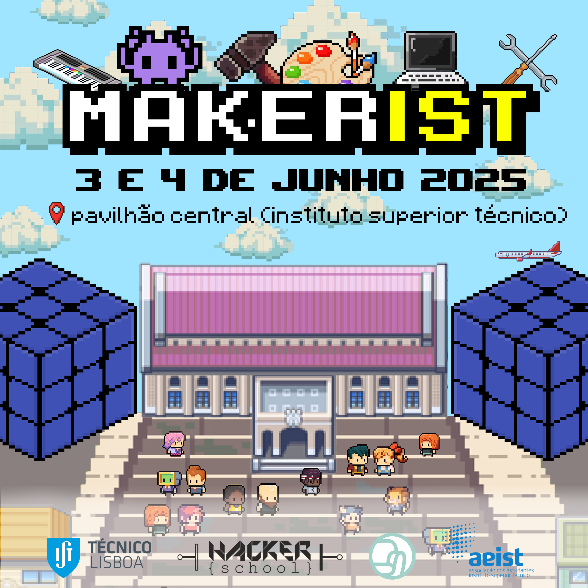

<!-- <b><b><b> -->
<!-- # MakerIST -->
<!-- <b><b><b> -->

## MakerIST

**June 3rd and 4th** | [**Central Pavilion of Instituto Superior Técnico**](https://maps.app.goo.gl/dLX5NzLvm9guL8Vf6)

**Free entry and open to the public!**

**MakerIST** is an event that celebrates maker culture, bringing together enthusiasts of creation, technology, and _Do-It-Yourself_ (DIY). On **June 3rd and 4th**, the **Central Pavilion of Instituto Superior Técnico** will be transformed into a dynamic space for learning, sharing, and creative experimentation, open to both the academic community and the general public.

<!-- Através de uma variedade de atividades envolventes, o MakerIST visa promover a cultura maker e estimular a inovação: -->
<!---->
<!-- - **Workshops práticos:** Oportunidades para colocar a mão na massa e aprender novas habilidades. -->
<!-- - **Palestras:** Apresentações sobre temas relevantes no mundo da criação e tecnologia. -->
<!-- - **Exposições de projetos inovadores:** Demonstrações de trabalhos criativos, artísticos e tecnológicos. -->
<!-- - **Atividades interativas:** Experiências como desmontagem eletrónica e arte generativa para despertar a curiosidade. -->

## Open Call

Do you have an interesting project and would like to have your own booth at MakerIST?

<!-- Candidata-te até **30 de maio** através deste link: [https://docs.google.com/forms/d/e/1FAIpQLSdtcaK02c86xVoH1fX-USOvp27kvuRPOQKaLTERcKKnckKjXA/viewform](https://docs.google.com/forms/d/e/1FAIpQLSdtcaK02c86xVoH1fX-USOvp27kvuRPOQKaLTERcKKnckKjXA/viewform) -->

Apply by **May 30th**!


## Objectives of MakerIST

<!-- - Celebrar e promover a cultura maker. -->
<!-- - Mostrar projetos inovadores e _open-source_. -->
<!-- - Fomentar a interação e a troca de ideias entre participantes. -->
<!-- - Explorar a fascinante intersecção entre arte e tecnologia. -->
<!-- - Divulgar e fortalecer a "free culture" e a democracia digital. -->
<!-- - Oferecer uma experiência que seja simultaneamente lúdica e educativa. -->


Celebrate and promote maker culture.
Showcase innovative and open-source projects.
Encourage interaction and the exchange of ideas among participants.
Explore the fascinating intersection between art and technology.
Promote and strengthen "free culture" and digital democracy.
Provide an experience that is both fun and educational.


## Events


Opportunities to get hands-on and learn new skills.
Presentations on topics relevant to the world of creation and technology.
Demonstrations of creative, artistic, and technological work.
Experiences such as electronic disassembly and generative art to spark curiosity.


## Confirmed Booths
















---

### HackerSchool Booths








## Confirmed Workshops

| Workshop                       | With                            | Date       | Hour | Local                    | Registrations                                     |
| ------------------------------ | ------------------------------ | ---------- | ---- | ------------------------ | ---------------------------------------------- |
| **Create your own Macropad**        | Gonçalo Fecha                  | June 3rd | 18h  | Room GA1 | [Closed]() |
| **Democratizing Sociology**  | Armando Gonçalves              | June 3rd | 18h  | Room GA2  | [Closed](https://hackerschool.tecnico.ulisboa.pt/workshops/social/)                  |
| **3D Modeling in Blender** | Margarida Prates | 4 de junho | 18h  | Sala GA1  | [Closed]()                             |

## Lectures

| Lecture                                                   | With   | Date       | Hour | Local            |
| ---------------------------------------------------------- | ----- | ---------- | ---- | ---------------- |
| **"What is _open-source_ and why should we care?"** | ANSOL | June 4th | 12h30 | Central Pavilion |

## Free Food & Drinks

Take the opportunity to recharge with the free food and drink options available at the event!

## For more information and contacts

**Team Lounge IST:**
[lounge](https://www.instagram.com/lounge.ist/) // [lounge.ist.sa@gmail.com](mailto:lounge.ist.sa@gmail.com)

**Team HackerSchool:**
[hackerschool](https://www.instagram.com/hackerschool_ist/) // [hackerschool@tecnico.ulisboa.pt](mailto:hackerschool@tecnico.ulisboa.pt)

