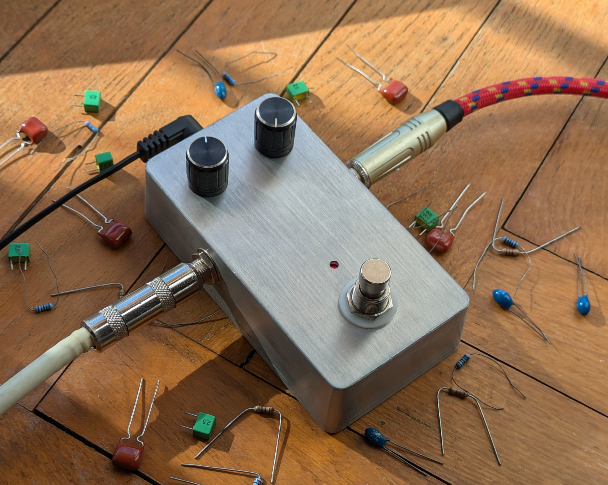

# Workshop FUZZ Pedal

Criado por [Miguel Lameiras](https://github.com/MiguelLameiras)

Os pedais de efeitos são ferramentas criativas essenciais na música, podendo ser utilizados com qualquer instrumento que produza um sinal elétrico. Neste workshop, pretendemos desmistificar alguma da ciência por trás deles, fomentar o espírito *maker* nesta área, e introduzir a criação de pedais de efeitos como um meio de expressão artística.

## Objetivos

Neste workshop _hands-on_ cada participante irá realizar a montagem de uma pedal de FUZZ 100% analógico, que poderá levar para casa no final da sessão. Este workshop irá abranger tudo, desde a explicação de efeitos de Distorção/Overdrive e Fuzz, explicação do circuito utilizado no pedal de Fuzz, soldadura dos componentes na PCB e montagem final numa *enclosure*. Este workshop é destinado tanto a pessoas com ou sem experiência em eletrónica analógica, assim como para quem tem ou não prática em soldadura.

   

## Planeamento
1. Noções matemáticas gerais de como produzir distorção, fuzz, etc.;
2. Breve introdução à eletrónica, nomeadamente transístores BJT;
3. Explicação do circuito utilizado;
4. Introdução à soldadura;
5. Soldadura dos diversos componentes na PCB;
6. Ligação dos componentes externos à PCB (Potenciómetros, Jacks e Bateria);
8. Montagem da PCB na caixa;
9. Teste dos pedais construídos.

## Recursos

Em breve...

## 1ª Edição

A primeira edição decorreu no dia 13 de Dezembro de 2024, das 17:30 às 22h, no OpenLab da AC de Computadores (Piso 4, Pavilhão de Electricidade, Torre Norte).

### Galeria

