# Workshop Git para Recrutas

Criado por [João Barreiros C. Rodrigues](https://jbcr.pt) e Francisco Carvalho

Auxiliado _in loco_ por Carlos Felgueiras 

Este workshop surge para dar os conhecimentos básicos do workflow da ferramenta git aos recrutas da HackerSchool, para que possam contribuir com eficiência para o desenvolvimento de projectos colectivos, dentro ou fora da HackerSchool!


## Temas Abordados

1. git?
2. Setup do git no terminal
3. Setup de um repositório local e remoto (GitHub)
4. Workflow simples: status, add, commit e push
5. Branches
6. Criar e Resolver Conflitos
7. Forking

## Recursos

* [Apresentação Powerpoint](./presentation.pdf)

## Conteúdo do Workshop

### O que é controlo de versões?

Controlo de versões é a gestão e documentação de várias iterações de _data_ (code, schematics, etc.).

É particularmente importante no contexto de Software Livre e de código aberto (Free and Open Source software) uma vez que a documentação cuidadosa do código das alterações entre versões pode ser muitas vezes crucial para a ágil resolução de _bugs_ e problemas!

### git?

O Git é um software de controlo de versões criado por Linus Torvalds (o criador do kernel Linux).
É código livre sobre GPL v2.0.

O Git permite cloning, pulling, pushing, etc. de dados guardados em outras instâncias remotas ou locais de git

### "Versioning"

Já aconteceu a todos

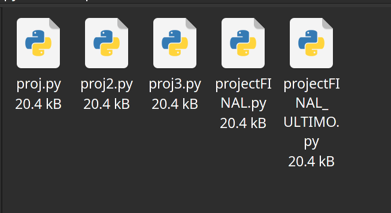

Hora de mandar isto p'ró galheiro

### E trocar por algo muito melhor...

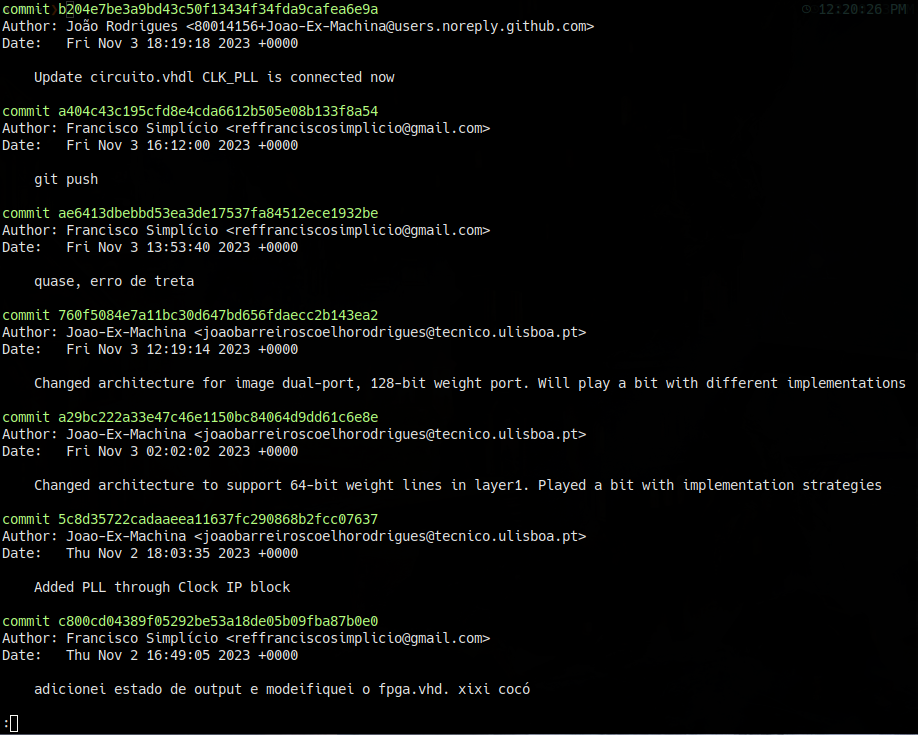

Oh yeah!

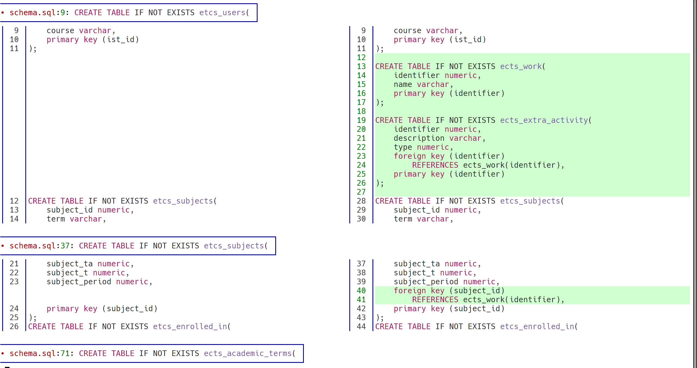


### Remotes

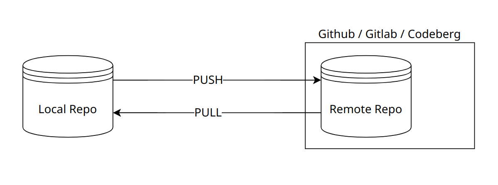

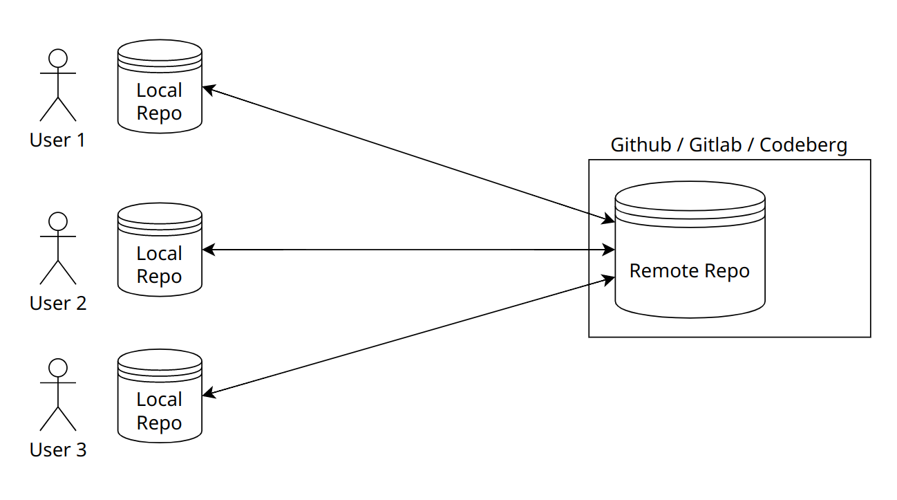

### Vamos começar - git por terminal UNIX com Github remoto

1. Cria a tua conta no [GitHub](https://github.com) (e-mails institucionais permitem o acesso fácil ao [Student Starter Pack](https://education.github.com/pack)).
2. Obtém o `git` e opcionalmente o `github-cli` (é bloat).
3. Log in pelo github-cli (ou melhor ainda usa uma [SSH Key/ Personal Access Token](https://github.com/github/docs/blob/main/content/authentication/connecting-to-github-with-ssh/generating-a-new-ssh-key-and-adding-it-to-the-ssh-agent.md))
4. Configura o teu user no git com:

	```bash
	git config --global user.name "@user.name" 

	git config --global user.email @user.email
	```

### Setup de um repositório no GitHub

Vai a [https://github.com/new](https://github.com/new) 

Depois de teres criado o teu repositório faz um cópia local com:

	```bash
	git clone <url_of_your_repo>
	```
**Atenção:** Se usaste a chave SSH para identificação, usa o url do protocolo SSH e não o HTTP

- HTTP URL
	- https://github.com/Joao-Ex-Machina/IST-PSD

- SSH URL
	- git@github.com:Joao-Ex-Machina/IST-PSD

### O teu primeiro commit!

### Git Status

O `git status` permite ver as alterações feitas no teu repo!

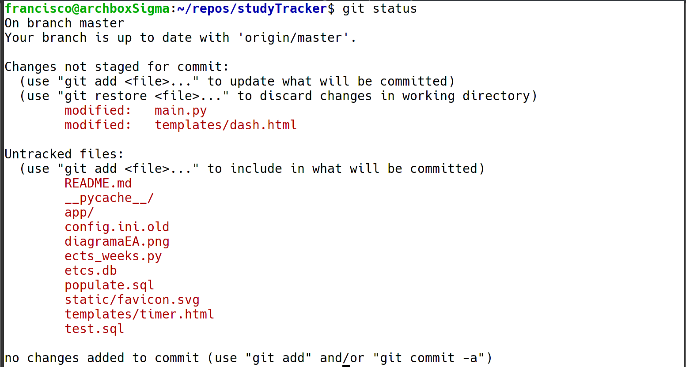


### Git Add

- Para adicionar as mudanças feitas a um ficheiro ao git log: `git add <file_path>` 
- Quando o ficheiro ainda não está a ter as alterações monitorizadas, o `git add` informa o git para o começar a fazer
- Este comando apenas seleciona alterações, não lhes dá "commit"

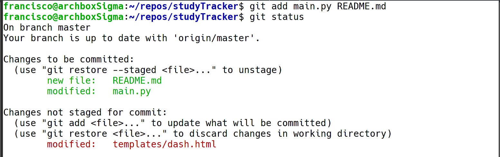


### Git Commit
- Para dar "commit" (isto é adicionar as alterações selecionadas à linha do tempo) utiliza-se `git commit -m "commit message"`

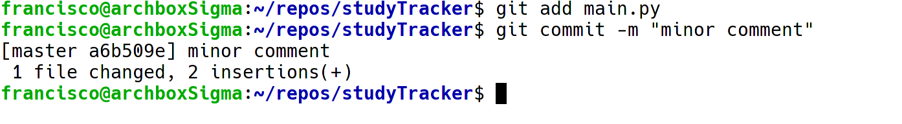

### Git Push
- Podes dar "push" da tua linha do tempo para um repo remoto utilizando `git push <name_of_remote_repo>`
    - Normalmente quando se usa o Github este repo remoto é o **origin**
- Mas podes ter múltiplos repos remotos!
    - Para o adicionar basta: `git remote add <name> <url>`, assim como fizemos com o origin

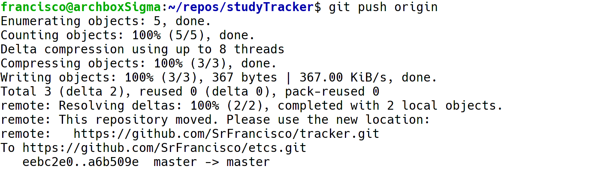

### Repositories and actions

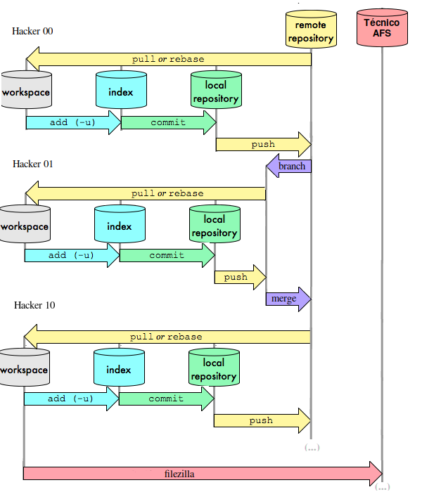

### Conflicts

Quando dois colaboradores alteram a mesma linha, a feature de auto-merge do GitHub não consegue resolver o conflicto.

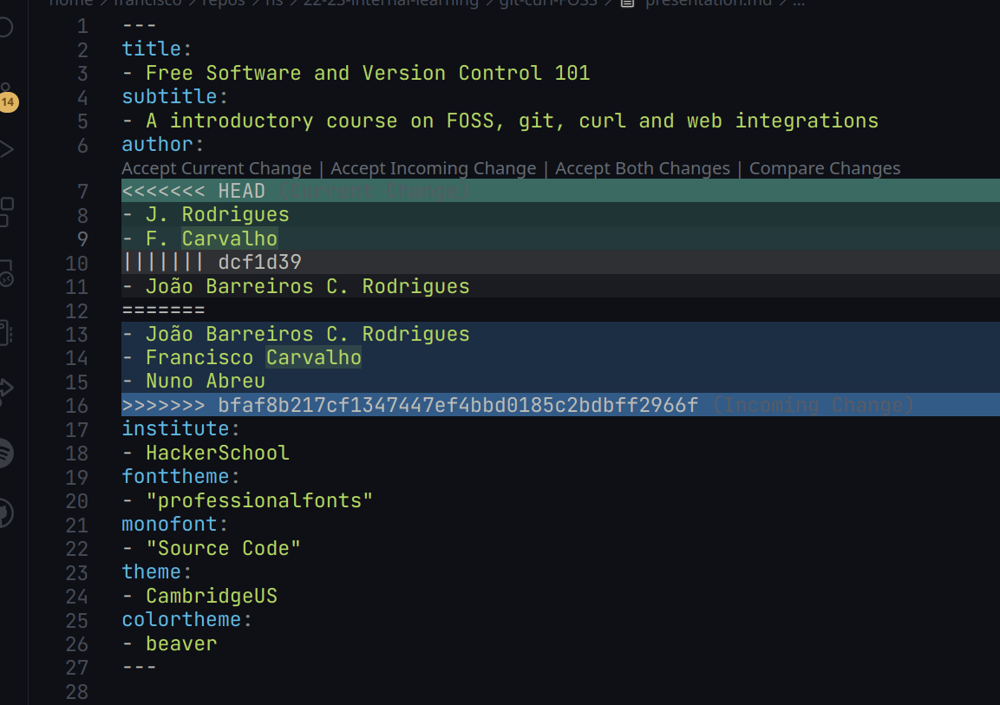

Para reparar basta ir ao ficheiro com conflictos e remover/manter as linhas desejadas! Muito simples!


### Branching
+ Branching é uma ferramenta elementar do git, que permite criar "ramificar" a linha do tempo, o que é principalmente útil quando as alterações que vamos colocar ainda não foram testadas por completo ou podem "partir" o branch principal - **master**

Mudar de branch é tão simples quanto usar: ` git checkout @branch` e para criar e mudar basta adicionar a flag `-b`

Para "juntar" as linhas do tempo utiliza-se: `git merge` o que pode gerar conflictos (mas que já sabes como reparar!)

### Forking (*)

O Forking é uma ferramenta importante de colaboração, de forma a poder contribuir para repositórios públicos sem ter permissões! Contudo esta operação é feita fora do git no terminal.

Basicamente estamos a criar uma cópia pessoal de um outro repositório!


### Merge/Pull Requests(*)

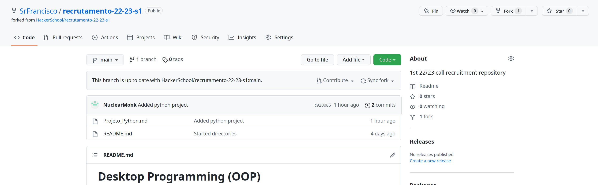

quando queremos dar merge de volta para o repo original abrimos um merge (ou pull) request

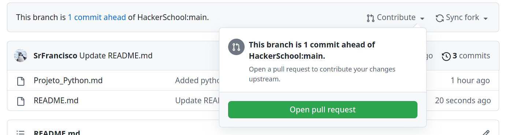


## Interessado?

A HackerSchool, em conjunto com o SCDEEC e com o NEEC irá realizar um workshop de git, com interface gráfica, extensivo e detalhado no início do segundo semestre, com atenção especial para os alunos da LEEC e LEAer. Fica atento!
