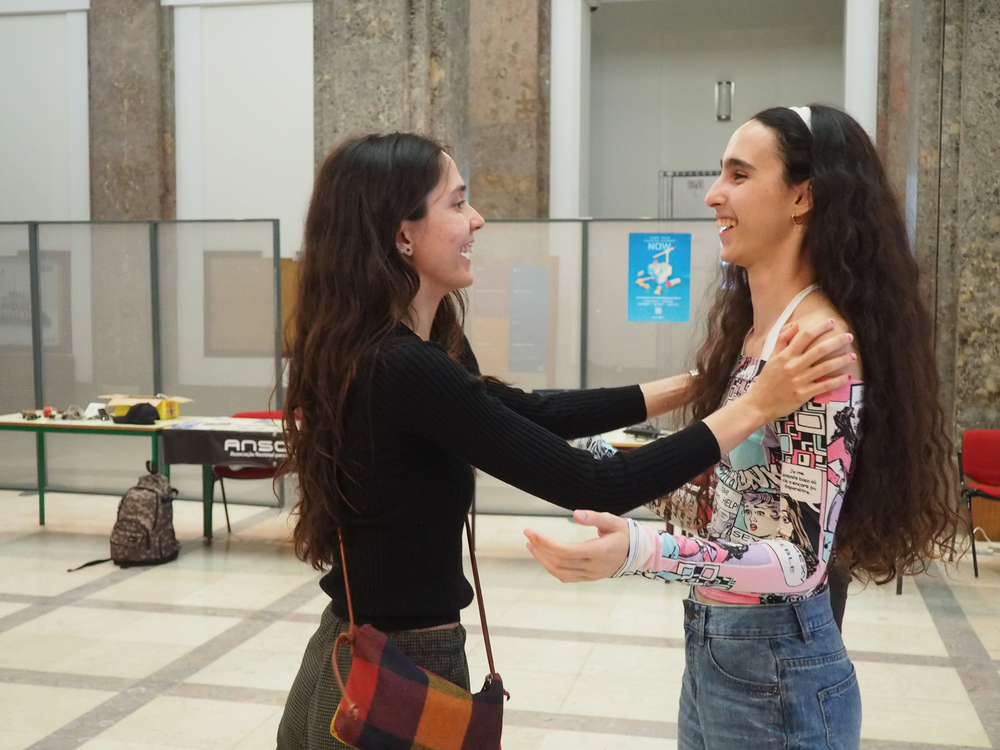

--- 
title: "Democratizando Sociologia" 
date: 2025-05-19 
draft: false 
description: "Desenvolve ferramentas sociais e fortalece a tua confiança num ambiente acolhedor!" 
image: "./social/socializar.jpg" 
---

   
   

# Workshop "Democratizando Sociologia"

Criado por [Armando Gonçalves](https://github.com/mr-arpg)

"Socializar" é fundamental para o nosso bem-estar emocional e desenvolvimento pessoal. Neste workshop, pretende-se desmistificar alguns dos desafios da comunicação interpessoal, fortalecer a autoconfiança dos participantes e criar um espaço seguro para reunir pessoas com o mesmo mindset, democratizando desta forma as tecnologias de sociologia.

## Objetivos

Neste workshop _interativo_ cada participante irá participar em atividades dinâmicas e exercícios práticos de comunicação, que podem ser aplicados imediatamente nas interações sociais do dia a dia. Este workshop abrangerá desde técnicas fundamentais de comunicação verbal e não-verbal, estratégias para iniciar e manter conversas, como superar a ansiedade social, entre outros temas. O workshop é destinado tanto para pessoas mais introvertidas que desejam superar a timidez, quanto para aquelas que já possuem facilidade social mas querem refinar e partilhar as suas ferramentas.

### O Que Esperar

> Ambiente acolhedor e livre de julgamentos

> Atividades práticas e dinâmicas em grupo

> Material de apoio exclusivo

> Momento de networking

> Grupo exclusivo para manter o contacto após o workshop

   

## 1ª Edição

A primeira edição aconteceu no dia 3 de junho de 2025, das 18:00 às 19:30h, na sala GA2 (Piso 0, Edifício Central do Instituto Superior Técnico, Alameda).



### Planeamento

1. Apresentação e breve _take_ pessoal sobre o tópico;
2. O protocolo "socializar";
3. Exploração dos 3 requisitos base;
4. Retrato de pessoa sociável vs não sociavel;
5. Atividade #1: _Canned Material_;
6. Atividade #2: "SSS";
7. Atividade #3: "YSL";
8. Atividade #4: Nomes;
9. Atividade #5: _"Eject Plan"_;
10. Atividade #6: Contar histórias com o _"LATED"_;
11. Comentários finais e sessão de networking entre os participantes.

## Recursos

### Material de Apoio
Slides de apoio do workshop: [Aceder aos Slides](https://ulisboa-my.sharepoint.com/:p:/g/personal/ist1100290_tecnico_ulisboa_pt/EZGJODzvQLFKlghB64hS6HgB0kN8quq8m49GJikKb-Dj3Q?e=FB2vOs)

### Desafio dos 30 Dias
Inspirado no livro do Neil Strauss, desenvolvi uma webapp interativa para acompanhar o teu progresso no desafio dos 30 dias. Cada dia tem um desafio específico para desenvolver as tuas habilidades sociais:



### Winner's Circle
Para quem completar o desafio, tens acesso ao Winner's Circle - um espaço exclusivo no Miro onde podes partilhar as tuas experiências e aprender com outros participantes:



## Galeria

