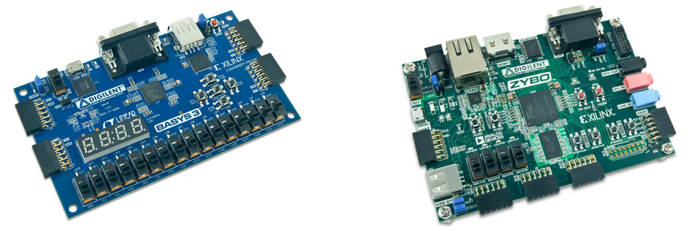
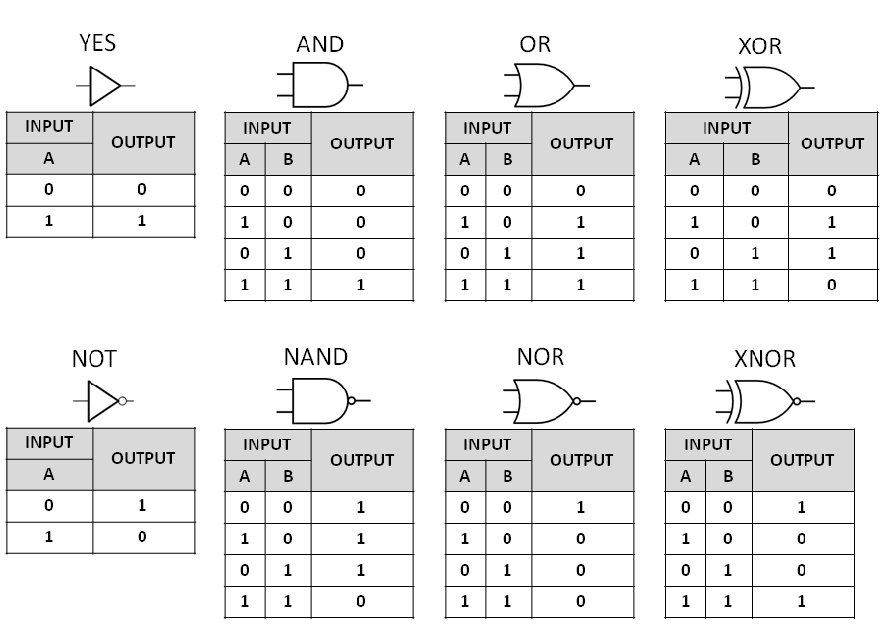
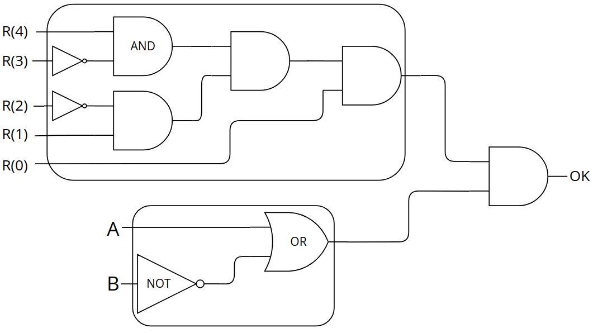
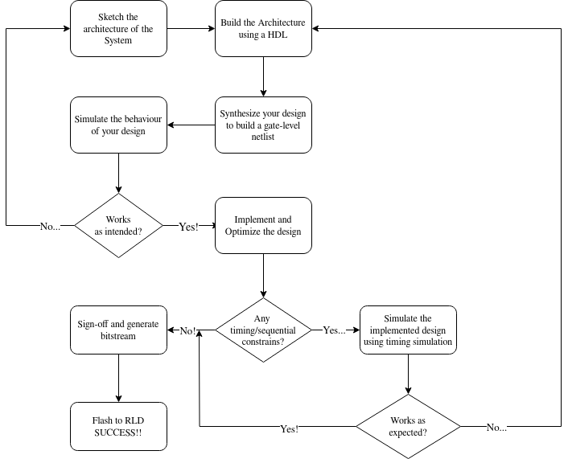
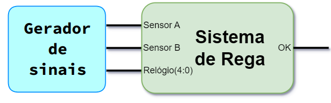

# Workshop Vivado101

Criado por [João Barreiros C. Rodrigues](https://jbcr.pt) e Filipe N. Piçarra

Bem-vindo ao Workshop Vivado 101! Este workshop tem como objetivo introduzir circuitos digitais combinatórios elementares, como descrevê-los com VHDL, e como simular, sintetizar e implementar em tecnologia FPGA o circuito implementado. Este workshop foi direccionado aos alunos de Sistemas Digitais da LEEC, LEFT e LEAer e foi concretizado como esforço conjunto com a AC de Computadores do DEEC.

## Temas Abordados

1. O que são sistemas digitais?
2. Funções lógicas elementares
3. Projecção de um Sistemas Digital Combinatório Simples
4. Descrição do Sistema Digital projectado com VHDL
5. Vivado Workflow - Simulação, síntese e implementação

## Recursos

* [Apresentação Powerpoint](./presentation.pdf)
* [Guia](./guide.pdf)
* [Circuito de Rega em VHDL](./rega.vhd)
* [Testbench em VHDL](./testbench.vhd)

## Conteúdo do Workshop

### O que são Sistemas Digitais?

No geral, um sistema digital é:

**Um circuito eletrónico que processa sinais discretos**

Estes sistemas formam a base da computação moderna e de dispositivos eletrónicos, abrangendo desde calculadoras simples a computadores complexos e smartphones.

**Hoje em dia, (quase) tudo é/tem um sistema digital!**

Como estudantes de Engenharia (especificamente Eletrotécnica, Aeroespacial e Física), os sistemas digitais são uma parte crucial do nosso currículo.

### Os Sistemas Digitais são o meu negócio, e o negócio está a ir bem!

**Sistemas Digitais de consumo geral**
    -> Computadores e integrantes (CPUs, GPUs, etc.)
    -> Microcontroladores (Microprocessadores)
    -> Wearables
    -> etc.
**Dispositivos de processamento em tempo (quase) real/crítico**
    -> Processamento de Imagens Aéreas
    -> Aceleradores para Inteligência Artificial
    -> Aceleradores para Encriptação
**Sistemas Embebidos e IoT**
    -> Redes de Sensores

**E muito, muito mais!**

### Como posso implementar o meu próprio Sistema Digital?

Bem, temos alguns fluxos de trabalho possíveis:

- Montar o nosso Sistema Digital a partir de componentes pré-fabricados
    - Breadboard + cabos + ICs = Sistema Digital
    - Software + Núcleos de CPU + Periféricos = Sistema Digital
- Podemos também projetar as nossas próprias soluções personalizadas do zero
    - Ficheiro GDSII + Wafer de Silício + Fundição = Sistema Digital (num único IC!)
    - Ficheiro HDL sintetizável + Dispositivo Lógico Reconfigurável = Sistema Digital (num RLD!)

### Dispositivos Lógicos Reconfiguráveis (RLDs)

Existem duas principais "famílias" de RLDs:

- FPGAs - Um agrupamento de Blocos Lógicos Configuráveis. Hoje em dia, os ICs FPGA também incluem unidades de memória e de processamento digital de sinal.
- SoC-FPGAs - Uma extensão da tecnologia FPGA, adicionando _cores_ CPU ao IC principal

Ambos são normalmente integrados em placas maiores (isto é com muitos I/O externos) de desenvolvimento:



### O Nosso Problema - Um Sistema Digital para Rega Automática

Queremos projetar um sistema simples para rega automática do nosso jardim, baseado em três fatores:

- A humidade atual do solo (Sensor A)
- A possibilidade de chuva no futuro próximo (Sensor B)
- O horário (Relógio)

O sinal **OK** deve ativar quando verificarmos duas condições:

- O Sensor A está **HIGH** **OU** o Sensor B está **LOW**, note-se que o **OU** não é exclusivo
- A hora é **19:XX**


## Fundamentos dos Sistemas Digitais

### Lógica Booleana

Na lógica booleana temos dois símbolos principais:

- **0** (Zero) - Falso ou LOW
- **1** (Um) - Verdadeiro ou HIGH

Adicionalmente:

- **X** (Don't care) - Pode ser **0** ou **1**, o que simplificar o nosso sistema

### Funções Lógicas Básicas

Agora podemos começar a construir **funções lógicas** simples como:

- **NOT** (Negação Lógica)
- **AND** (Multiplicação Lógica)
- **OR** (Adição Lógica)
- **XOR** (OU Exclusivo)

### Funções Lógicas Básicas



### Sistemas Combinatórios - Um aperitivo para as mentes curiosas

A partir das funções apresentadas anteriormente, podemos construir **qualquer** sistema combinatório! Claro que os sistemas combinatórios são apenas um **subconjunto** do mundo dos sistemas digitais, pois **não possuem** "memória".

Em breve, também aprenderão como minimizar o número de portas necessárias para uma função, de modo a construí-las facilmente. Utilizarão **Mapas de Karnaugh** como meio para alcançar este fim.

### Esboço do nosso Sistema de "Rega"



## VHDL simplificado para design digital formal!

### Linguagens de Descrição de Hardware

Existem 2 principais Linguagens de Descrição de Hardware (HDLs):

- **VHDL** - Very High Speed IC (VHSIC) HDL
- **Verilog**

VHDL é normalmente utilizado para fins académicos e de pesquisa, bem como nas **aulas de Sistemas Digitais**, portanto será a nossa linguagem alvo.

### Linguagens de Descrição de Hardware

É importante notar que VHDL e Verilog (e todas as outras HDLs) não são Linguagens de Programação,

**Nós não programamos circuitos digitais... nós desenhamo-los!**

Isto requer uma perspetiva arquitectural - uma grande distinção entre Engenharia Informática e Engenharia de Computadores.

Podemos dizer, no entanto, que **programamos** o nosso **Dispositivo Lógico Reconfigurável** (FPGA).

### Passos do Design Digital - O meu fluxo de trabalho



### Projecto com VHDL

Em VHDL, cada componente de circuitos digitais tem 2 secções principais:

- **Entidade (entity)**: Define o nome e I/O do componente
- **Arquitetura (architecture)**: Descreve o que está "debaixo do capô" do componente
    - Quais os **sinais que conectam**, **aonde** e a **o quê**!

Podemos instanciar múltiplas secções de **entity** como **components** na secção **architecture**, por exemplo, se os nossos componentes Y tiverem outros componentes X na sua arquitetura.

**Não esquecer!**: Um sinal em VHDL é equivalente a um fio num sistema físico. Uma parte crucial na perspetiva arquitectural!

### Projecto com VHDL - Um buffer simples

```vhdl
library IEEE; -- Libs. with pre-def. components for synthesis
use IEEE.std_logic_1164.all;
entity example_buffer is -- Component Name... 
    port ( -- ...and I/O (Black-box)
        input: in std_logic;
        output: out std_logic);
end example_buffer;
-- Now describe the component innards!
architecture behavioral of example_buffer is
   internal_signal: std_logic_vector(1 downto 0)
Begin
    internal_signal(0) <= input; -- Just to exemplify
    internal_signal(1) <= '0'; --We can also 'fix' signals
    output <= internal_signal(0); 
end behavioral;

```
## O que é a Suite AMD Xilinx Vivado e como nos ajuda?

### Vivado Suite?

O **Vivado Suite** é um ambiente de software para EDA, com 3 componentes principais:

- **Vivado** - Uma ferramenta independente de síntese, implementação, integração de IP e simulação para design de Sistemas Digitais
- **Vitis HLS** - Uma ferramenta de Síntese de Alto Nível, que permite a descrição de Hardware através da linguagem C
- **Vitis IDE** - Um Ambiente Integrado para desenvolvimento de software embebido

Para a Unidade Curricular de Sistemas Digitais, usaremos o **Vivado** apenas.

## Porquê o Vivado?

Vivado fornece uma interface gráfica (GUI) sobre scripts TCL, que automatizam:

- Síntese
- Implementação
- Otimização
- Simulação

Adicionalmente, podemos configurar a maioria das definições relevantes para cada um desses passos.

## Simulação no Vivado

O Vivado fornece um visualizador de formas de onda, que usamos para avaliar o nosso design!

Apesar de automatizar o processo de simulação, ainda temos de definir o nosso próprio testbench - isto pode ser feito com outro ficheiro VHDL.

Na cadeira de Sistemas Digitais, o **testbench relevante será fornecido**, portanto, não é necessário preocuparem-se!

## "Gerador de sinais" em VHDL para simulação

Precisamos de integrar um "gerador de sinais" para testar o nosso sistema. 

Devemos garantir que todas as entradas possíveis produzem o **output correto**



## O nosso "Gerador de sinais"


```vhdl
(...) -- Libs, etc.
ENTITY rega_tb IS
END rega_tb; 
ARCHITECTURE behavior OF rega_tb IS 
    -- Component Declaration for the Unit Under Test (UUT)
    COMPONENT rega
    PORT(
        relogio: in std_logic_vector (4 downto 0);
        (...)
    END COMPONENT;
   --TB signals
    signal relogio : std_logic_vector := (others => '0');
    (...)
   -- Clock period definitions
   constant clk_period : time := 10 ns;

BEGIN
	-- Instantiate the Unit Under Test (UUT)
   uut: rega PORT MAP(
        relogio => relogio;
        (...)
    );
   -- Clock definition
   clk <= not clk after clk_period/2;
   
   -- Stimulus process
   stim_proc: process
   begin		
      -- hold state for 100 ns.
      wait for 100 ns;	
      -- insert stimulus here 
      -- note that input signals should never change at the positive edge of the clock
        relogio <= "00000" after 30 ns,
        sensorA <= '0' after 30 ns,
        sensorB <= '0' after 30 ns,
        (...)
      wait;
   end process;

END;

```

# Interessado?

Tens interesse em sistemas de computação, computação reconfigurável ou simplesmente design de sistemas digitais? Vêm visitar-nos ao OpenLab da AC de Computadores (Piso 4, Pavilhão de Electricidade, Torre Norte) para discutir com o João sobre o vosso interesse em comum ou apenas experimentares algumas plataformas FPGA/SoC-FPGA como:
* • Basys3
* • Pynq
* • Kria Vision AI
* • EBAZ4205
* • Colorlight-5a-75e

