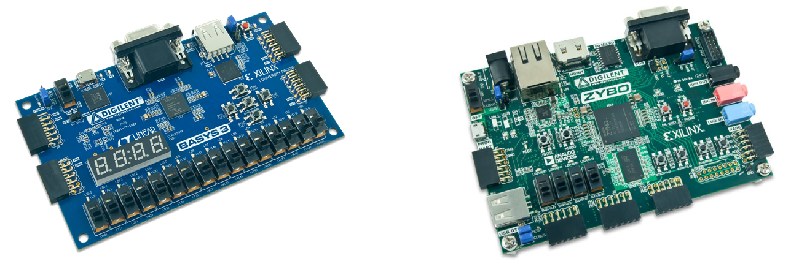
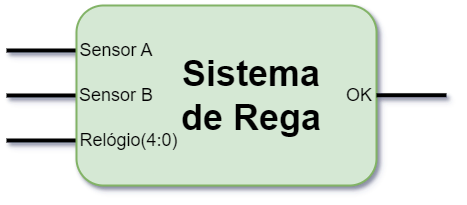
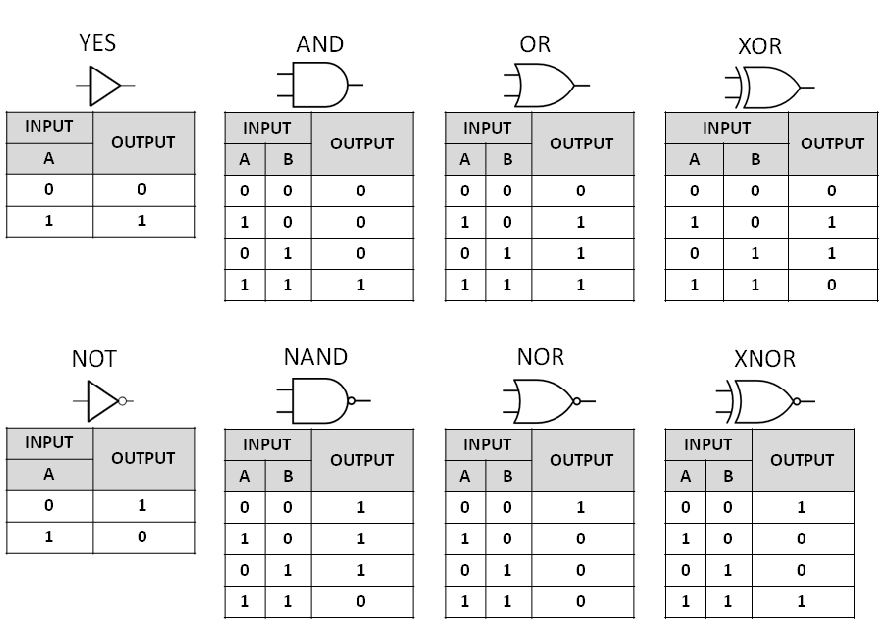
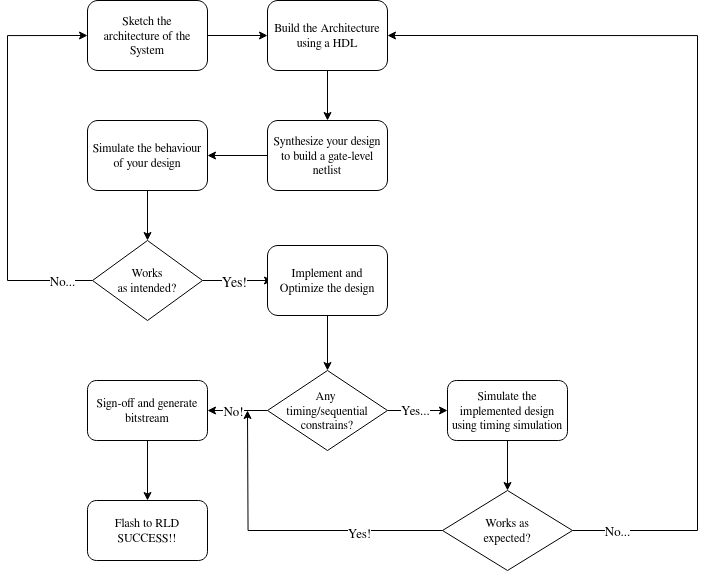
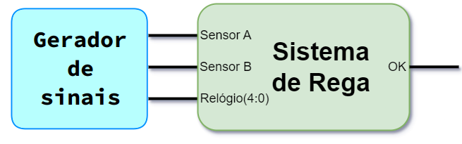

---
title:
- Digital Systems Design 101
subtitle:
- Introduction to Digital Systems and the AMD Xilinx Vivado Suite
author:
- Filipe Nobre Piçarra
- João Barreiros C. Rodrigues
institute:
- HackerSchool
- Departamento de Engenharia Eletrotécnica e Computadores
- Instituto Superior Técnico
fonttheme:
- "professionalfonts"
monofont:
- "Source Code"
theme:
- CambridgeUS
colortheme:
- beaver
---

# What are Digital Systems?

## Digital Systems

Overall a digital system is:

**An electronic circuit that processes discrete signals**

These systems form the foundation of modern computing and electronic devices, ranging from simple calculators to complex computers and smartphones. 

**Nowadays (almost) everything is/has a digital system!**

As Eng. students (specifically ECE, Aero and Physics) digital systems are a crucial part of our curriculum.

## Digital Systems are my business, and business is good!

- Consumer-grade Digital Systems
    - Computers (CPUs, GPUs, etc.)
    - Microcontrollers (Microprocessors)
    - Wearables
    - etc.
- (Near) Real-time / Critical processing devices
    - Aerial Imaging
    - Artifical Intelligence Accelerators
    - Encryption Accelerators
- Embedded Systems and IoT
    - Sensor Meshes

**And many, many more!**

## How do I Implement my own Digital System?

Well, we have a few possible workflows:

- Assembling our Digital System from pre-made components
    - Breadboard + Wires + ICs = Digital System
    - Software + CPU Cores + Peripherals = Digital System
- Designing our own custom solutions from scratch
    - GDSII file + Silicon Wafer + Foundry = Digital System (in a single IC!)   
    - HDL file + Reconfigurable Logic Device = Digital System (in a RLD!)

## Reconfigurable Logic Device

There are two main "families" of RLD:

- FPGAs - A grouping of Configurable Logic Blocks. Nowadays FPGA ICs also include memory and DSP devices.
- SoC-FPGAs - An extension on the FPGA technology, adding CPU cores to the IC

Both are normally integrated in larger boards for development purposes.

{ width=70% }

## Our Problem - A Digital System for Automatic "Rega"

We want to design a simple system for automatic watering of our garden, based on three factors:

- The present soil humidity (Sensor A)
- The raining possibility in the near-future (Sensor B)
- The time (Relógio)

The **OK** signal should fire when we verify two conditions:

- Sensor A is **HIGH** **OR** Sensor B is **LOW**, not the **OR** is not exclusive
- The time is **19:XX** 

{ width=40% }

# A step back - Digital Systems Fundamentals

## Boolean Logic

In Boolean logic we have two main symbols:

- **0** (Zero) - False or Low
- **1** (One) - True or High

Additionally:

- **X** (Don't care) - Can be **0** or **1**, whatever simplifies our system

## Basic Logic Functions

Now we can start constructing simple **logic functions** such as:

- **NOT** (Logic Negation)
- **AND** (Logic Multiplication)
- **OR** (Logic Addition)
- **XOR** (Exclusive OR)

## Basic Logic Functions

{ width=80% }

## Combinatorial Systems - An appetizer for the curious mind

From the previous showed functions we can construct **any** combinatorial system! Of course combinatorial systems are only a **subset of the whole digital systems world**, since they **do not have** any "memory".

Soon you will also learn how to minimize the number of gates needed for a function, so that you can easily construct them. You will use **Karnaugh Maps** to achieve this. 

## Sketching our "Rega" System

**Any ideas for our system?**

## Sketching our "Rega" System


# A step forward - Using VHDL to do formal digital design!

##  Hardware Description Languages

There are two 2 main Hardware Description Languages (HDLs):

- **VHDL** - Very High Speed IC (VHSIC) HDL
- **Verilog**

VHDL is normally used for academic and research purposes, as well as in **Digital Systems lecturing**, therefore it will be our target language.


## Hardware Description Languages

It is important to note that VHDL and Verilog (and all other HDLs) are not Programming Languages,

**We do not program digital circuits...we design them!**

This requires some architectural-perspective - a great distinction between Computer Engineering and Computer Science.

We can say, however, that we will **program/flash** our **Reconfigurable Logic Device** (FPGA).

## Digital Design Steps - My Workflow

{ width=70% }


## Designing with VHDL

In VHDL each digital circuit components has 2 main sections:

- **Entity**: Defines the name and I/O of the component
- **Architecture**: Describes the what's under the hood of the component
    - Which **signals connect**, **where** and to **what**!

We can instance multiple **entity** sections as **components** in the **Architecture** section, for example if our components Y has others components X in its architecture.

**Remember!**: A signal in VHDL is equivalent to a wire in a physical system. A crucial part in the architectural perspective!

## Designing with VHDL - A simple buffer

```vhdl
library IEEE; -- Libs. with pre-def. components for synthesis
use IEEE.std_logic_1164.all;
entity example_buffer is -- Component Name... 
    port ( -- ...and I/O (Black-box)
        input: in std_logic;
        output: out std_logic);
end example_buffer;
-- Now describe the component innards!
architecture behavioral of example_buffer is
   internal_signal: std_logic_vector(1 downto 0)
Begin
    internal_signal(0) <= input; -- Just to exemplify
    internal_signal(1) <= '0'; --We can also 'fix' signals
    output <= internal_signal(0); 
end behavioral;

```

# Another step forward - What is the AMD Xilinx Vivado Suite and how does it help us?

## Vivado Suite?

The **Vivado Suite** is an EDA software enviroment, with 3 main components:

- **Vivado** - An independent synthesis, implementation, IP integrator and simulation tool for Digital System design 
- **Vitis HLS** - A High-Level Synthesis tool, which allows the description of Hardware through C-language
- **Vitis IDE** - An Integrated Enviroment for developing embedded software

For the Digital Systems Curricular Unit, we will be using **standalone Vivado**.

## Why Vivado?

Vivado provides a wrapper GUI around TCL scripts, which automate:

- Synthesis
- Implementation
- Optimization 
- Simulation

Additionally we can configure most of the relevant settings for each of those steps.

## Simulation in Vivado

Vivado provides an waveform viewer, which we use to evaluate our design!

Despite automating the simulation process, we still have to define our own testbench - this can be achieved with another VHDL source file.

In the Digital Systems course, the **relevant testbench will be provided**, so no need to worry!

## "Signal generator" in VHDL for simulation

We have to provide a "signal generator" to testbench our system. 

We should ensure all possible inputs produce the **correct output**



## Designing our "Signal generator"

```vhdl
(...) -- Libs, etc.
ENTITY rega_tb IS
END rega_tb; 
ARCHITECTURE behavior OF rega_tb IS 
    -- Component Declaration for the Unit Under Test (UUT)
    COMPONENT rega
    PORT(
        relogio: in std_logic_vector (4 downto 0);
        (...)
    END COMPONENT;
   --TB signals
    signal relogio : std_logic_vector := (others => '0');
    (...)
   -- Clock period definitions
   constant clk_period : time := 10 ns;
```
## Designing our "Signal generator" (cont.)

```vhdl
BEGIN
	-- Instantiate the Unit Under Test (UUT)
   uut: rega PORT MAP(
        relogio => relogio;
        (...)
    );
   -- Clock definition
   clk <= not clk after clk_period/2;   
```
## Designing our "Signal generator" (cont.)

```vhdl
    -- Stimulus process
   stim_proc: process
   begin		
      -- hold state for 100 ns.
      wait for 100 ns;	
      -- insert stimulus here 
      -- note that input signals should never change at the positive edge of the clock
        relogio <= "00000" after 30 ns,
        sensorA <= '0' after 30 ns,
        sensorB <= '0' after 30 ns,
        (...)
      wait;
   end process;

END;

```

# One last step forward - Let's design our own "Rega" Digital System!

